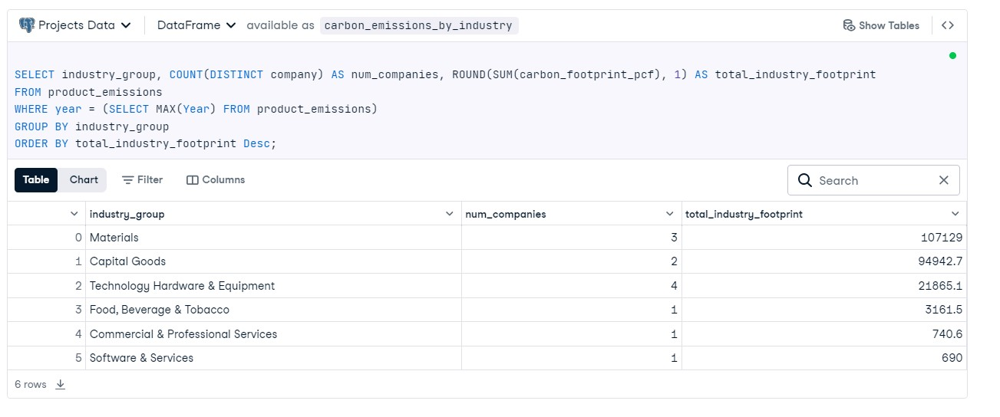

# Analysis-of-Carbon-Footprints-by-Industry-Group

## Introduction
As global awareness of climate change and environmental impact grows, understanding carbon emissions from various industries has become crucial. This project analyzes the carbon footprints of different industry groups using data from the product_emissions table. The aim is to identify the number of unique companies in each industry group and their total carbon footprint for the most recent year available in the dataset. This analysis provides insights into which industries contribute significantly to carbon emissions, aiding in the formulation of strategies for reduction.

## Project Objectives
The primary objective of this analysis is to answer the following question:

What is the total carbon footprint (PCF) for each industry group, and how many unique companies are associated with each group for the most recent year in the dataset?

## Methodology
To achieve the analysis objectives, the following steps were undertaken:

**Data Source**: The analysis utilized the product_emissions table, which contains data on the carbon footprints of various products from different companies categorized by industry groups.

**Filtering for Recent Data**: The query focused on retrieving data for the most recent year available in the database to ensure relevance.

**SQL Query Execution**:

The SQL query was structured to select the industry_group, count the number of unique companies (num_companies), and calculate the total carbon footprint for each industry group (total_industry_footprint).
The total carbon footprint was rounded to one decimal place for clarity.
The results were sorted by total_industry_footprint in descending order to highlight the industries with the highest emissions.

## Analysis and Findings

The analysis indicates that the **Materials** industry group has the highest total carbon footprint at **107,129.0** PCF, followed by **Capital Goods** with **94,942.7** PCF. In contrast, the **Software & Services** sector has the lowest footprint, contributing only **690** PCF. The Technology Hardware & Equipment and Food, Beverage & Tobacco sectors show moderate footprints of 21,865.1 PCF and 3,161.5 PCF, respectively. Notably, the Commercial & Professional Services sector has a relatively small total footprint of 740.6 PCF.

## Conclusion
This project effectively analyzed the carbon footprints of various industry groups, highlighting significant disparities in emissions. The **Materials** and **Capital Goods** sectors emerged as the largest contributors to carbon emissions, indicating a need for targeted sustainability efforts within these industries. Conversely, the lower emissions from the Software & Services sector suggest potential for growth in sustainable practices within tech-based companies.

Understanding these dynamics is crucial for stakeholders aiming to formulate strategies that target high-emission industries for reduction efforts. These findings not only provide a snapshot of current emissions but also serve as a foundation for future research into the effectiveness of emission reduction initiatives and corporate responsibility in the pursuit of sustainability.
## Project Notebook
You can view the complete project notebook on DataCamp Datalab by [Clicking here](https://www.datacamp.com/datalab/w/55d5ebdb-c83a-4aed-887a-48ef05db65f5/edit)
